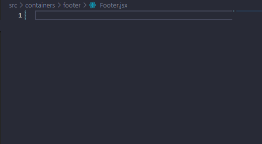
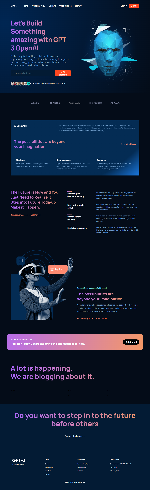

# GPT3 Web Site

## Introduction

> This web site was made with react to build a web site to show the features of GTP3 AI

## Technologies used
<p align="left">
 
 
 

 
 
 </p>

## What I learned with this project?
- Best practise to organize my project
- To have a archive to import all of components and export it. An example of this
  ```javascript
    import blog01 from '../../assets/blog01.png';
    import blog02 from '../../assets/blog02.png';

    export {
        blog01,
        blog02,
    };

    // or export directly

    export { default as Blog } from './blog/Blog';
    export { default as Features } from './features/Features';
 
  ```
- Tricks to create a component easily with a VSCode extension named [React Extension Pack](https://marketplace.visualstudio.com/items?itemName=jawandarajbir.react-vscode-extension-pack)
  - To create a component easily, run this command in the archive .jsx
    ```
    rafce + tab
    ```
    
## Presentation of the application

- This is a image that show the full site


## How to run?

- Clone this repository
- Run this command on the terminal to install all of dependencies
  ```
  npm i
  ``` 
- Then, run this command
    ```javascript
    npm run start
    ```
